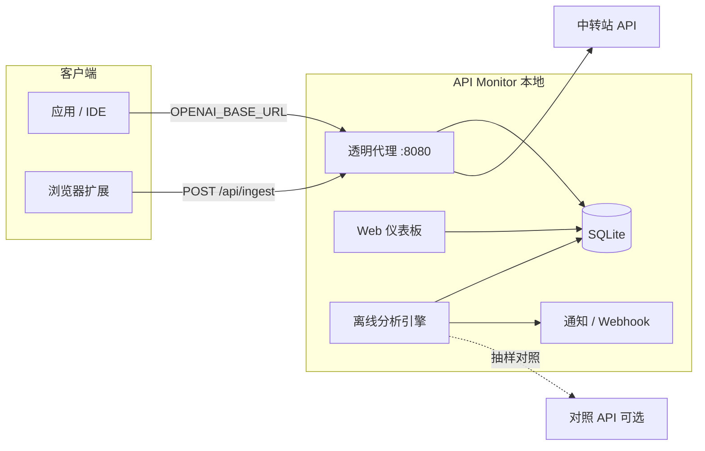

# API Monitor

[](LICENSE)
[](https://www.python.org/)
[](https://github.com/308081164/api_monitor/releases)

**API 中转站被动式模型真实性持续监控系统。**

在不改动业务代码的前提下，通过透明代理或浏览器扩展采集 LLM API 响应，在本地闲时进行离线分析，检测中转站是否**偷换模型**、**掺水降级**或**响应分布异常漂移**。

---

## 目录

- [适用场景](#适用场景)
- [核心能力](#核心能力)
- [系统架构](#系统架构)
- [安装方式](#安装方式)
- [快速上手](#快速上手)
- [配置说明](#配置说明)
- [命令行参考](#命令行参考)
- [采集方案 A / B](#采集方案-a--b)
- [分析与告警](#分析与告警)
- [项目结构](#项目结构)
- [开发与测试](#开发与测试)
- [发布与下载](#发布与下载)
- [文档索引](#文档索引)
- [常见问题](#常见问题)
- [许可证](#许可证)

---

## 适用场景

| 场景 | 说明 |
|------|------|
| 使用第三方 API 中转站 | 怀疑实际模型与宣称不符 |
| 多模型混用 | 需长期基线对比，发现静默替换 |
| 本地/内网部署 | 数据不出本机，离线 embedding 分析 |
| Web 端无法改 `base_url` | 配合方案 B 浏览器扩展上报 |

**不适用：** 需要实时 inline 拦截并阻断请求的场景（本系统以**被动记录 + 闲时分析**为主）。

---

## 核心能力

| 类别 | 能力 |
|------|------|
| **采集** | 方案 A 透明代理（OpenAI 兼容 `/v1`）；方案 B 浏览器扩展 `fetch` 钩子 + `/api/ingest` |
| **存储** | SQLite 记录请求/响应元数据与文本片段 |
| **分析** | 语义 embedding 漂移、ITT/TTFT 时序、Logprobs、多信号融合、基线 EMA 自动更新 |
| **告警** | 告警历史平滑、系统桌面通知、Webhook、仪表板引导配置 |
| **对照** | 可选官方 API 对照样本（`SENTINEL_REFERENCE_UPSTREAM_URL`） |
| **交付** | CLI、Web 仪表板、Markdown/HTML/JSON 报告、Docker/systemd、Windows 一键安装包 |

---

## 系统架构



**数据流简述：**

1. 客户端将 `OPENAI_BASE_URL` 指向本地代理 `http://127.0.0.1:8080/v1`。
2. 代理转发至真实中转站，同时异步写入 SQLite。
3. 用户通过仪表板或 `api-monitor analyze` 触发离线分析，输出报告与告警。

---

## 安装方式

### 方式一：Windows 一键安装（推荐普通用户）

在 [GitHub Releases](https://github.com/308081164/api_monitor/releases) 下载：

```text
{版本号}_windows-set-up.exe
```

例如：`0.5.0_windows-set-up.exe`。

| 步骤 | 操作 |
|------|------|
| 1 | 运行安装程序，可自选安装目录 |
| 2 | 可选：创建桌面快捷方式、固定到开始菜单 |
| 3 | 从开始菜单或桌面打开 **API Monitor** → 自动启动服务并打开仪表板 |
| 4 | 关闭窗口即停止后台服务；卸载时自动清理进程 |

- **数据目录：** `%APPDATA%\API Monitor\`
- **上游配置：** 设置环境变量 `SENTINEL_UPSTREAM_URL`，或在仪表板「首次使用引导」中填写  
- **构建说明：** [installer/windows/README.md](installer/windows/README.md)

### 方式二：Python 包（开发者 / Linux / macOS）

**要求：** Python 3.10+

```bash
git clone https://github.com/308081164/api_monitor.git
cd api_monitor
pip install -e ".[analyze,dev]"
```

| 可选依赖组 | 安装命令 | 用途 |
|------------|----------|------|
| `analyze` | `pip install -e ".[analyze]"` | 离线 embedding 分析（sentence-transformers） |
| `alerts` | `pip install -e ".[alerts]"` | 跨平台系统通知（plyer） |
| `dev` | `pip install -e ".[dev]"` | pytest 等开发工具 |

Linux 系统通知建议额外安装：`sudo apt install libnotify-bin`

### 方式三：Docker Compose

```bash
cd deploy
export SENTINEL_UPSTREAM_URL="https://你的中转站.example.com"
docker compose up -d
```

- 端口：`8080`
- 数据卷：`api-monitor-data` → `/data/responses.db`

### 方式四：systemd（Linux 裸机 7×24）

详见 [docs/OPERATIONS.md](docs/OPERATIONS.md) 第 2 节，使用 `deploy/api-monitor.service` 与 `/etc/api-monitor/env`。

---

## 快速上手

### 1. 配置上游中转站

```bash
export SENTINEL_UPSTREAM_URL="https://你的中转站.example.com"
# 可选：官方 API 对照
export SENTINEL_REFERENCE_UPSTREAM_URL="https://api.openai.com"
```

### 2. 启动服务

```bash
api-monitor serve
```

启动后终端会打印：

| 端点 | 地址 |
|------|------|
| OpenAI 兼容代理 | `http://127.0.0.1:8080/v1` |
| Web 仪表板 | `http://127.0.0.1:8080/dashboard` |
| 扩展上报 | `http://127.0.0.1:8080/api/ingest` |
| 健康检查 | `http://127.0.0.1:8080/health` |

### 3. 将客户端指向本地代理

```bash
export OPENAI_BASE_URL="http://127.0.0.1:8080/v1"
# 保持原有 API Key，由代理转发至中转站
```

正常使用应用一段时间，产生若干 API 调用记录。

### 4. 查看状态与生成报告

```bash
api-monitor status
api-monitor analyze -o report.md
api-monitor analyze --format json -o report.json
api-monitor analyze --format html -o report.html
```

若存在高风险告警，`analyze` 退出码为 `1`（便于 CI 集成）。

### 5. 模型升级后重建基线

```bash
api-monitor baseline-refresh
```

---

## 配置说明

### 环境变量

| 变量 | 默认值 | 说明 |
|------|--------|------|
| `SENTINEL_UPSTREAM_URL` | — | **必填**（生产环境）：中转站 API 根地址，勿带尾部 `/v1` |
| `SENTINEL_REFERENCE_UPSTREAM_URL` | — | 对照 API 根地址（官方 OpenAI 等），用于参考样本比对 |
| `SENTINEL_HOST` | `127.0.0.1` | 监听地址 |
| `SENTINEL_PORT` | `8080` | 监听端口 |
| `SENTINEL_DB_PATH` | `responses.db` | SQLite 数据库路径 |
| `SENTINEL_DATA_DIR` | `~/.api-monitor` | 默认数据目录（部分工具使用） |
| `SENTINEL_MIN_TEXT_LENGTH` | `32` | 参与分析的最小响应文本长度 |
| `SENTINEL_DRIFT_THRESHOLD` | `0.15` | 语义漂移告警阈值 |
| `SENTINEL_BASELINE_MIN_SAMPLES` | `20` | 建立基线所需最少样本数 |
| `SENTINEL_TIMING_PVALUE` | `0.05` | ITT/TTFT 时序检验 p 值阈值 |
| `SENTINEL_BASELINE_AUTO_UPDATE` | `true` | 低风险样本是否 EMA 更新基线 |
| `SENTINEL_BASELINE_EMA_ALPHA` | `0.08` | 基线 EMA 学习率 |
| `SENTINEL_ALERT_SMOOTHING_WINDOW` | `3` | 告警历史平滑窗口（抑制抖动） |
| `SENTINEL_LOGPROBS_PVALUE` | `0.01` | Logprobs 分布漂移 p 值阈值 |
| `SENTINEL_ENABLE_DASHBOARD` | `true` | 是否启用 Web 仪表板 |
| `SENTINEL_ENABLE_CORS` | `true` | 是否允许浏览器扩展跨域上报 |
| `SENTINEL_ANALYSIS_MODE` | `lite` | `lite`（MiniLM）或 `precise`（MPNet，更准更慢） |

> 兼容别名：未设置 `SENTINEL_UPSTREAM_URL` 时会尝试读取 `OPENAI_BASE_URL`（仅作上游解析，勿与客户端指向本地的 `base_url` 混淆）。

### 用户设置文件（`user-settings.json`）

与数据库同目录，可由仪表板「引导向导」写入，优先级覆盖部分环境变量：

| 字段 | 说明 |
|------|------|
| `upstream_url` | 中转站地址 |
| `reference_upstream_url` | 对照 API 地址 |
| `analysis_mode` | `lite` / `precise` |
| `alert_system_notify` | 是否推送系统通知 |
| `alert_webhook` / `webhook_url` | Webhook 告警 |
| `alert_min_risk` | 最低通知风险级别：`medium` / `high` |

---

## 命令行参考

```bash
api-monitor --help
```

| 子命令 | 说明 |
|--------|------|
| `serve` | 启动透明代理与仪表板 |
| `status` | 查看已记录响应数与基线数量 |
| `analyze` | 离线批量分析并生成报告 |
| `baseline-refresh` | 用全部历史记录重建基线（不产生告警报告） |

### `serve` 常用参数

```bash
api-monitor serve --host 0.0.0.0 --port 8080 \
  --upstream https://relay.example.com \
  --db /var/lib/api-monitor/responses.db \
  --no-dashboard
```

### `analyze` 常用参数

```bash
api-monitor analyze --limit 500 \
  --format json -o report.json \
  --min-length 64 \
  --no-notify   # 不发送系统通知/Webhook
```

---

## 采集方案 A / B

| | 方案 A：透明代理 | 方案 B：浏览器扩展 |
|---|------------------|-------------------|
| **适用** | 可修改 `OPENAI_BASE_URL` 的桌面/服务端应用 | 网页端、无法改 base URL |
| **原理** | FastAPI 反向代理 + 响应落库 | 注入 `fetch`，POST 至 `/api/ingest` |
| **文档** | 本文「快速上手」 | [extension/README.md](extension/README.md) |
| **限制** | 需应用走 HTTP 代理配置 | 仅捕获页面内 `fetch`，无原生应用流量 |

**推荐：** 能改 `base_url` 时优先方案 A，数据更完整；Web 专用场景叠加方案 B。

---

## 分析与告警

### 分析模式

| 模式 | 模型 | 特点 |
|------|------|------|
| `lite`（默认） | `all-MiniLM-L6-v2` | 速度快、资源占用低 |
| `precise` | `all-mpnet-base-v2` | 精度更高，首次需下载模型 |

设置方式：`export SENTINEL_ANALYSIS_MODE=precise` 或仪表板 / `user-settings.json`。

### 检测信号（概要）

- **语义漂移：** 响应 embedding 相对基线余弦距离
- **时序特征：** 首 token 延迟（TTFT）、token 间隔（ITT）分布检验
- **Logprobs：** 若上游返回 logprobs，做分布漂移检测
- **融合评分：** 多信号加权，输出 `low` / `medium` / `high` 风险等级

### 告警通道

1. **系统桌面通知** — `analyze` 或仪表板分析后触发（Windows/macOS/Linux）
2. **Webhook** — 在 `user-settings.json` 或仪表板配置 URL
3. **报告文件** — Markdown / HTML / JSON

安装增强通知：

```bash
pip install 'api-monitor[alerts]'
```

### 对照验证

配置 `SENTINEL_REFERENCE_UPSTREAM_URL` 后，分析器可拉取官方 API 样本与中转站响应对照，辅助判断「像不像真模型」而不仅是「像不像昨天的自己」。

---

## 项目结构

```text
api_monitor/
├── src/api_monitor/
│   ├── proxy/          # 透明代理、响应提取
│   ├── storage/        # SQLite 日志、基线、用户设置
│   ├── analyzer/       # 漂移、融合、报告、对照验证
│   ├── alerts/         # 系统通知、Webhook 分发
│   ├── dashboard/      # Web UI、ingest API
│   └── cli/            # 命令行入口
├── extension/          # 方案 B 浏览器扩展
├── installer/windows/  # Windows 安装包构建
├── deploy/             # Docker、systemd
├── docs/               # 技术方案与运维手册
└── tests/              # pytest 单元测试
```

---

## 开发与测试

```bash
pip install -e ".[analyze,dev]"
pytest
```

贡献前请确保测试通过；大功能变更请先阅读 [docs/MVP-开发任务.md](docs/MVP-开发任务.md) 与完整技术方案。

---

## 发布与下载

推送 `main` 分支后，GitHub Actions [Release 工作流](.github/workflows/release.yml) 自动构建并发布：

| 资产 | 说明 |
|------|------|
| `{version}_windows-set-up.exe` | Windows 安装程序 |
| `*.whl` / `*.tar.gz` | Python 分发包 |
| `docs-bundle.zip` | 文档打包 |

标签格式：`v{version}-build.{run_number}`（例如 `v0.5.0-build.12`）。

---

## 文档索引

| 文档 | 内容 |
|------|------|
| [完整技术方案](docs/API中转站被动监控系统-完整技术方案.md) | 架构与算法设计 |
| [可行性报告](docs/API中转站被动式模型真实性持续监控系统-技术规划与可行性报告.md) | 背景与规划 |
| [MVP 开发任务](docs/MVP-开发任务.md) | 分阶段任务清单 |
| [生产运维手册](docs/OPERATIONS.md) | Docker/systemd、备份、故障排查 |
| [Windows 构建](installer/windows/README.md) | 安装包本地构建 |
| [浏览器扩展](extension/README.md) | 方案 B 使用说明 |

---

## 常见问题

**Q: 代理返回 502 `upstream_not_configured`？**  
A: 未设置 `SENTINEL_UPSTREAM_URL`，或未在仪表板完成引导。也可在请求头携带 `X-Sentinel-Upstream`（高级用法）。

**Q: `analyze` 提示缺少依赖？**  
A: 执行 `pip install 'api-monitor[analyze]'`，首次运行会下载 embedding 模型。

**Q: 浏览器扩展无法上报？**  
A: 确认 `api-monitor serve` 已启动、`SENTINEL_ENABLE_CORS=true`，且 `content.js` 中 `INGEST_URL` 端口一致。

**Q: 误报太多？**  
A: 增大 `SENTINEL_ALERT_SMOOTHING_WINDOW`、运行 `baseline-refresh`、或降低 `SENTINEL_BASELINE_EMA_ALPHA`。

**Q: 漏报太多？**  
A: 减小 `SENTINEL_DRIFT_THRESHOLD` 或改用 `precise` 分析模式。

**Q: 数据隐私？**  
A: 默认全部本地 SQLite，分析离线进行；仅在你配置 Webhook 时才会外发告警摘要。

---

## 许可证

本项目采用 [Mozilla Public License 2.0](LICENSE)（MPL-2.0）。

---

## 相关链接

- **仓库：** https://github.com/308081164/api_monitor  
- **问题反馈：** https://github.com/308081164/api_monitor/issues  
- **发布页：** https://github.com/308081164/api_monitor/releases  
